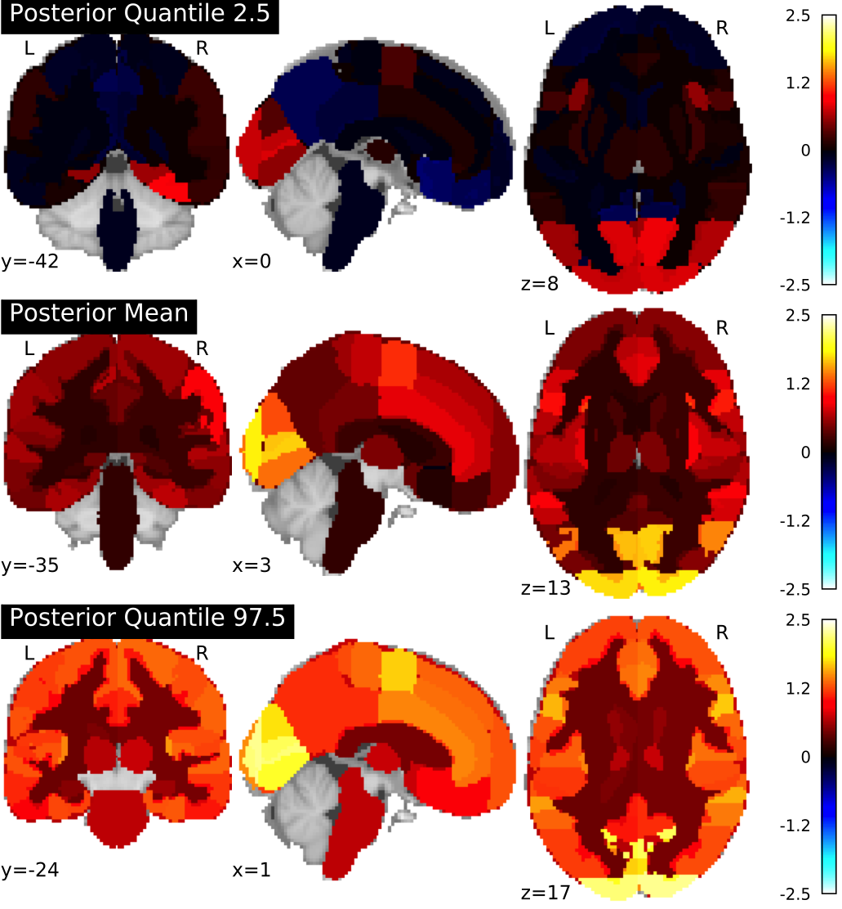

# bayesParcel

A project estimating fMRI group-level results through Bayesian hierarchical modeling with whole-brain parcellations as observational units

Authors: [Yaniv Abir](https://github.com/yanivabir), [Paul A. Bloom](https://github.com/pab2163), & [Monica Thieu](https://github.com/monicathieu)

## Project Summary

Inspired by ideas from a recent preprint [(Chen et al., 2018)](https://www.biorxiv.org/content/biorxiv/early/2017/12/22/238998.full.pdf) we set out here to try to offer an alternate approach to whole-brain inference by employing Bayesian Hierarchical Modeling with ROIs as the observational units. This approach should let us estimate activity for all regions at the population level simultaneously, using partial pooling to effectively account for multiple comparisons [(Gelman, Hill, & Yajima, 2012)](https://www.tandfonline.com/doi/abs/10.1080/19345747.2011.618213). Under this approach, we model the predicted activity for each region within each subject using Stan [(Carpenter et al., 2017)](https://www.jstatsoft.org/article/view/v076i01/v76i01.pdf). 

## Repository Elements

*	Markdown documenting the project and a case study analysis can be found [here](scripts/R/)
*	Jupyter Notebooks with brain image preproc can be found [here](scripts/jupyterNotebooks)
*	Stan models can be found here

## Future Directions

The repository and write-up as it currently stands is more of a proof of concept than a functional prototpye of this approach. We hope to extend the materials here into a more cohesive and scalable set of tools for using Bayesian Hierarchical Modeling for group-level fMRI analysis. 

